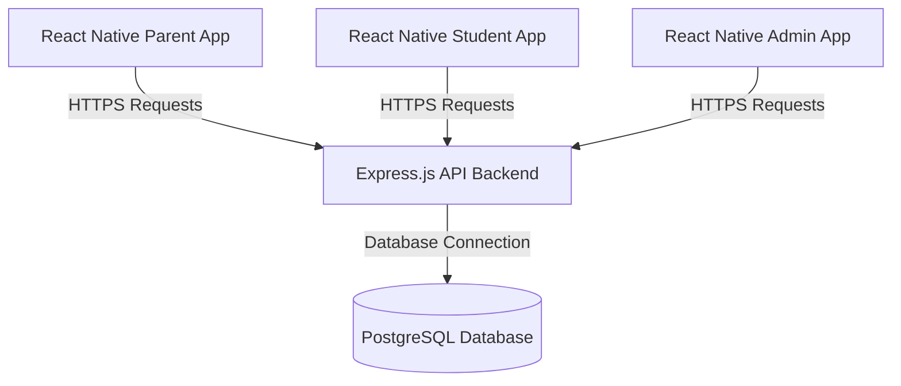

# SDC Education App

A comprehensive mobile education management application designed to bridge the gap between administrators, teachers, students, and parents. The application consists of a React Native mobile frontend (powered by Expo) and an Express.js/PostgreSQL backend hosted on Google Cloud Run.

---

## Architecture Overview



### 1. Frontend Architecture

- Built with **React Native** and **Expo**.
- **Navigation**: Uses `@react-navigation/bottom-tabs` and `@react-navigation/native-stack` to split workflows dynamically by role.
- **State Management**: React Context (`UserSessionContext`) keeps track of logged-in sessions and the selected active child (for parents).
- **Icons**: Lucide icons via `lucide-react-native`.

### 2. Backend Architecture

- Built with **Express.js** and Node.
- **Database**: PostgreSQL (hosted on Google Cloud SQL) with connection pooling via `pg`.
- **Authentication**: JWT token-based authorization and Google Sign-In verification.
- **File Storage**: Google Cloud Storage integration for study materials, test questionnaires, and student submissions.

---

## Role Features

### 👨‍👩‍👦 Parent Features

- **Dashboard Summary**: Real-time metrics overview for the active child, showing attendance percentage, upcoming test counts, outstanding fee indicators, and average grade percentages.
- **Sibling Child-Switching**: Bottom-sheet selection picker allowing parents with multiple children enrolled at Suresh Dani's Classes (SDC) to toggle data dashboards instantly.
- **Attendance Breakdown**: Overall attendance stats, subject-wise breakdown percentages, and detailed lists of recent unexcused absences.
- **Performance History**: Overall average grades, dynamically calculated class ranking per test, subject-wise averages, and data-driven feedback messages.
- **Fee Management**: Paid/pending fee status metrics, quarterly payment balances, and deterministic history of successfully cleared transactions.
- **Profile Management**: Profile card showing contact details, active child references, and session logout functionality.

### 🎓 Student Features

- Attendance log dashboards.
- Subject-wise lecture updates and materials (notes, textbook chapters, pyqs).
- Test schedule listings and submission upload handlers (uploading PDF answers to Cloud Storage).
- Test grade results and remarks review once released by instructors.

### 💼 Admin & Owner Features

- Adding and editing student enrollment databases and parent associations.
- Assigning student batch associations.
- Conducting and marking student attendance for lectures.
- Creating batches and scheduling lectures.

---

## Local Setup & Installation

### Prerequisites

- **Node.js** (v18 or higher recommended)
- **Expo Go** app installed on a physical mobile device, or an active Android Emulator / iOS Simulator.
- **PostgreSQL Database** running locally or on Cloud SQL.

### Step 1: Clone and Install Dependencies

Install all package dependencies in both the root directory (frontend) and the backend folder:

```bash
# Install frontend dependencies
npm install

# Install backend dependencies
cd backend
npm install
cd ..
```

### Step 2: Environment Configuration

Create a configuration file named `env` in the **root directory** for the Expo app:

```env
EXPO_PUBLIC_API_URL=http://localhost:8080
```

Create a `.env` file in the **`backend` directory** for database and authentication credentials:

```env
PORT=8080
DB_HOST=127.0.0.1
DB_PORT=5420
DB_NAME=sdc_database
DB_USER=sdc_admin
DB_PASSWORD=your_db_password
JWT_SECRET=your_jwt_secret
GOOGLE_ANDROID_CLIENT_ID=your_google_client_id
RESEND_API_KEY=your_resend_api_key
```

### Step 3: Database Migrations and Seeding

1. Run the core migrations on your PostgreSQL instance:
   ```bash
   psql -U sdc_admin -d sdc_database -f backend/migrations/001_core_institute.sql
   ```
2. Seed the initial database records from a CSV source:
   ```bash
   node backend/seed.js
   ```

---

## Running the Application Locally

### 1. Start the Backend Server

```bash
cd backend
npm start
```

The server will start listening at `http://localhost:8080`. You can test connection health by visiting `http://localhost:8080/db-test`.

### 2. Start the Expo Frontend Client

In a separate terminal shell, run:

```bash
npm start
```

- Scan the printed QR code using the **Expo Go** application on iOS or Android.
- Press `a` to run in an Android Emulator.
- Press `i` to run in an iOS Simulator.
- Press `w` to run in a web browser.

---

## Backend Redeployment to Google Cloud Run

To build and deploy the updated Node.js Express server to Google Cloud Run, execute the following commands in sequence:

### 1. Build and Submit Container Image

Submit the backend codebase to Google Cloud Build, tagging the image inside Artifact Registry:

### 2. Deploy to Cloud Run
